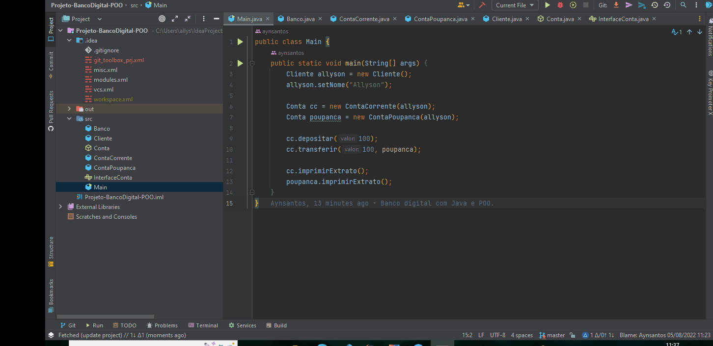

## Banco Digital POO

Abstraindo o conhecimento bancário, resumi uma solução orientada a objetos em Java. 

## Features:

O banco oferece `ContaCorrente` `ContaPoupança`. 
Funcionalidades `Sacar`, `Depositar` e `Transferir`. 

##

<h1 align="center">
   
</h1>
